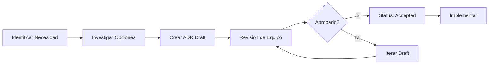

# Architecture Decision Records (ADR) Log

Este documento sirve como indice centralizado de todas las decisiones arquitectonicas del proyecto PriceWaze.

---

## Como usar ADRs

1. **Nueva decision**: Copiar `ADR-000-template.md` y renombrar con el siguiente numero
2. **Formato**: `ADR-XXX-titulo-corto.md`
3. **Estado**: Propuesto → Aceptado → (Deprecated/Superseded si cambia)
4. **Actualizar este log** despues de cada nuevo ADR

---

## Registro de Decisiones

| ADR | Titulo | Estado | Fecha | Categoria |
|-----|--------|--------|-------|-----------|
| [ADR-001](./ADR-001-supabase-over-firebase.md) | Supabase sobre Firebase | Accepted | 2025-01-06 | Backend/DB |
| [ADR-002](./ADR-002-deepseek-ai-provider.md) | DeepSeek como AI Provider | Accepted | 2025-01-06 | AI/ML |
| [ADR-003](./ADR-003-crewai-multiagent.md) | CrewAI para Multi-Agente | Accepted | 2025-01-06 | AI/ML |
| [ADR-004](./ADR-004-zustand-state.md) | Zustand para State Management | Accepted | 2025-01-06 | Frontend |
| [ADR-005](./ADR-005-module-consolidation.md) | Consolidacion Modulos Alerts/Signals | Accepted | 2026-01-08 | Architecture |

---

## ADRs por Categoria

### Backend / Database
- [ADR-001](./ADR-001-supabase-over-firebase.md): Supabase como BaaS con PostgreSQL + PostGIS

### AI / Machine Learning
- [ADR-002](./ADR-002-deepseek-ai-provider.md): DeepSeek API como proveedor principal de AI
- [ADR-003](./ADR-003-crewai-multiagent.md): CrewAI para sistema multi-agente

### Frontend
- [ADR-004](./ADR-004-zustand-state.md): Zustand para state management con persistencia

### Architecture
- [ADR-005](./ADR-005-module-consolidation.md): Consolidacion de modulos alerts/signals

---

## Estadisticas

| Estado | Cantidad |
|--------|----------|
| Accepted | 5 |
| Proposed | 0 |
| Deprecated | 0 |
| Superseded | 0 |

---

## Proceso de Decision

---

## Referencias

- [Template ADR](./ADR-000-template.md)
- [Michael Nygard's ADR Article](https://cognitect.com/blog/2011/11/15/documenting-architecture-decisions)
- [ADR GitHub Organization](https://adr.github.io/)

---

*Ultima actualizacion: 2026-01-08*
