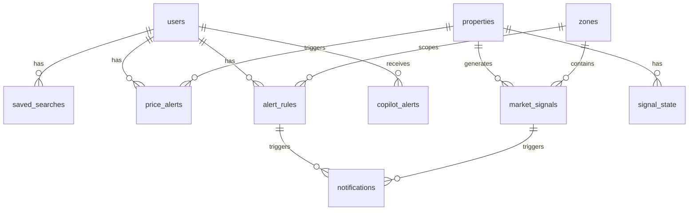

# Module Dependencies Map

## Overview

Este documento mapea las dependencias entre módulos de PriceWaze, identificando áreas de acoplamiento y oportunidades de refactorización.

---

## Dependency Graph - Alerts & Signals Domain

```mermaid
graph TD
    subgraph Pages["Dashboard Pages"]
        AP["(dashboard)/alerts/page.tsx"]
        MAP["(dashboard)/market-alerts/page.tsx"]
        PP["(dashboard)/properties/[id]/page.tsx"]
    end

    subgraph Components["UI Components"]
        CA["components/alerts/"]
        CS["components/signals/"]
        CV["components/visits/"]
        CP["components/properties/"]
    end

    subgraph API["API Routes"]
        AA["/api/alerts/"]
        AAR["/api/alert-rules/"]
        AS["/api/signals/"]
        AMS["/api/market-signals/"]
        ACA["/api/copilot/alerts/"]
        APR["/api/properties/"]
    end

    subgraph Lib["Business Logic"]
        LE["lib/alerts/evaluateRule.ts"]
        LG["lib/alerts/generateSignals.ts"]
    end

    subgraph Data["Database Tables"]
        TSS["pricewaze_saved_searches"]
        TPA["pricewaze_price_alerts"]
        TAR["pricewaze_alert_rules"]
        TMS["pricewaze_market_signals"]
        TPSS["pricewaze_property_signal_state"]
        TCA["pricewaze_copilot_alerts"]
    end

    %% Page dependencies
    AP --> CA
    MAP --> CA
    PP --> CS

    %% Component dependencies
    CA --> LE
    CV --> CS
    CP --> CS

    %% API dependencies
    AA --> TSS
    AA --> TPA
    AAR --> TAR
    AAR --> LE
    AS --> TPSS
    AMS --> TMS
    ACA --> TCA
    APR --> LG

    %% Lib dependencies
    LG --> TMS

    %% Cross-cutting
    AA -.-> AAR
    AS -.-> AMS

    classDef duplicate fill:#ff6b6b,stroke:#333
    classDef overlap fill:#feca57,stroke:#333
    class AP,MAP duplicate
    class AA,AAR,AS,AMS overlap
```



---

## Module Analysis

### 1. Duplicate Pages (Critical)

| File | Lines | Purpose |
|------|-------|---------|
| `(dashboard)/alerts/page.tsx` | 211 | Spanish UI, 3 tabs (market-alerts, rules, searches) |
| `(dashboard)/market-alerts/page.tsx` | 196 | English UI, 2 tabs (alerts, rules) |

**Code Duplication**: ~80%
**Recommendation**: Consolidate into single page with i18n

### 2. API Route Overlap

| Route | Table | Purpose |
|-------|-------|---------|
| `/api/alerts/` | `pricewaze_saved_searches`, `pricewaze_price_alerts` | User saved searches |
| `/api/alert-rules/` | `pricewaze_alert_rules` | JSON Logic rules |
| `/api/signals/` | `pricewaze_property_signal_state` | Signal state recalculation |
| `/api/market-signals/` | `pricewaze_market_signals` | Market signals CRUD |
| `/api/copilot/alerts/` | `pricewaze_copilot_alerts` | AI Copilot alerts |

**Naming Confusion**: "alerts" vs "signals" terminology inconsistent
**Recommendation**: Clear domain separation (user-facing alerts vs system signals)

### 3. Component Dependencies

```
components/alerts/
├── AlertRuleBuilder.tsx    ← imports lib/alerts/evaluateRule
├── MarketAlertsFeed.tsx    ← fetches /api/market-signals
└── SavedSearches.tsx       ← fetches /api/alerts

components/signals/
├── PropertySignals.tsx     ← fetches /api/signals
└── ReportSignalButtons.tsx ← posts to /api/signals
```

**Import Graph**:
```
pages/alerts       → components/alerts → lib/alerts/evaluateRule
pages/market-alerts → components/alerts → lib/alerts/evaluateRule
pages/properties/[id] → components/signals
components/visits  → components/signals
components/properties → components/signals
```

### 4. Lib Module Usage

| File | Used By |
|------|---------|
| `lib/alerts/evaluateRule.ts` | `/api/alert-rules/`, `/api/alerts/process/`, `AlertRuleBuilder.tsx` |
| `lib/alerts/generateSignals.ts` | `/api/properties/`, `/api/properties/[id]/` |

---

## Circular Dependencies

**Status**: ✅ No circular dependencies detected

```bash
npx madge --circular src/
# Output: 0 circular dependencies
```

---

## Coupling Analysis

### High Coupling (Concern)

| Module A | Module B | Coupling Type |
|----------|----------|---------------|
| `alerts/page.tsx` | `market-alerts/page.tsx` | Code duplication |
| `/api/alerts/` | `/api/alert-rules/` | Shared domain |
| `/api/signals/` | `/api/market-signals/` | Similar purpose |

### Recommended Decoupling

1. **Pages**: Merge into single `alerts/page.tsx` with locale switch
2. **API Routes**:
   - Keep `/api/alerts/` for user preferences
   - Keep `/api/alert-rules/` for rule management
   - Consolidate `/api/signals/` + `/api/market-signals/`
3. **Components**: Keep separated (different UI concerns)

---

## Database Table Relationships



---

## Import Frequency Analysis

| Module | Import Count | Importers |
|--------|-------------|-----------|
| `@/lib/alerts/evaluateRule` | 4 | alert-rules API, alerts process API, AlertRuleBuilder |
| `@/lib/alerts/generateSignals` | 2 | properties API routes |
| `@/components/alerts/*` | 2 | alerts page, market-alerts page |
| `@/components/signals/*` | 3 | properties detail, visits, property detail |

---

## Recommended Module Structure (Post-Consolidation)

```
src/
├── app/
│   ├── (dashboard)/
│   │   └── alerts/page.tsx          # Single consolidated page
│   └── api/
│       ├── alerts/                   # User alerts & searches
│       │   ├── route.ts             # Saved searches
│       │   ├── rules/route.ts       # Alert rules (moved from alert-rules/)
│       │   └── process/route.ts     # Alert processing
│       ├── signals/                  # System signals
│       │   ├── route.ts             # Market signals (from market-signals/)
│       │   ├── recalculate/route.ts # Signal recalculation
│       │   └── report/route.ts      # Signal reporting
│       └── copilot/
│           └── alerts/route.ts      # AI Copilot alerts
├── components/
│   ├── alerts/                       # User-facing alert UI
│   └── signals/                      # Property signal displays
└── lib/
    └── alerts/                       # Alert business logic
        ├── evaluateRule.ts
        └── generateSignals.ts
```

---

## Migration Path

### Phase 1: Documentation (Current)
- [x] Document current structure
- [x] Identify overlaps
- [x] Create ADR

### Phase 2: Consolidation
- [ ] Merge page duplicates
- [ ] Reorganize API routes
- [ ] Update imports

### Phase 3: Cleanup
- [ ] Remove deprecated routes
- [ ] Add redirects for backwards compatibility
- [ ] Update tests

---

*Ultima actualizacion: 2026-01-08*
