# Data Flow Diagram: Copilot Alerts System

## Overview
Este diagrama muestra el flujo del sistema de alertas inteligentes del Copilot v1, incluyendo deteccion automatica, evaluacion y notificacion.

---

## Diagrama de Flujo Principal

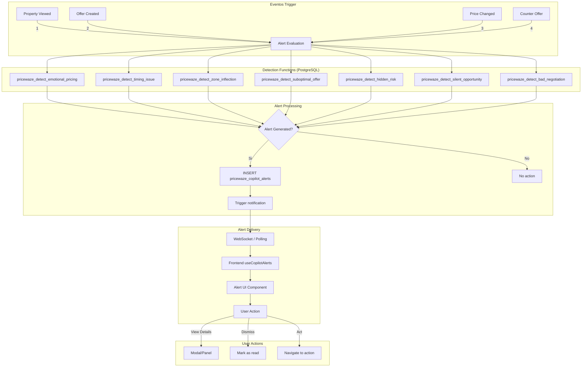

---

## Funciones de Deteccion

### 1. Emotional Pricing Detection

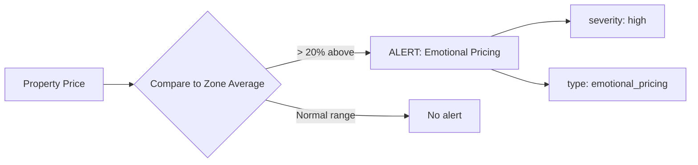

### 2. Timing Issue Detection

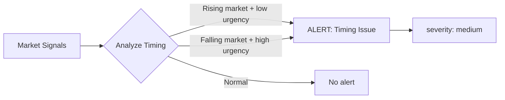

### 3. Zone Inflection Detection

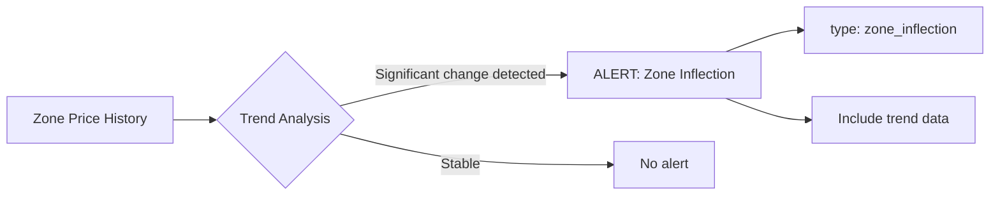

### 4. Suboptimal Offer Detection

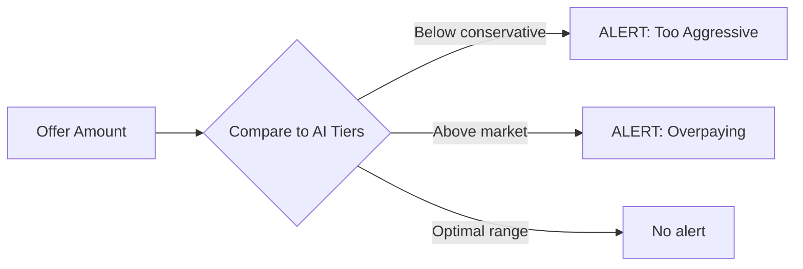

### 5. Hidden Risk Detection

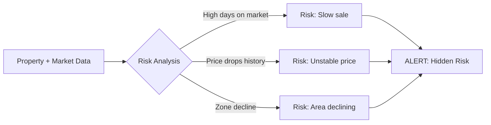

### 6. Silent Opportunity Detection

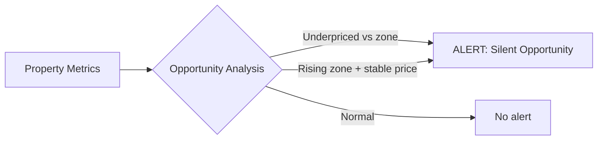

### 7. Bad Negotiation Detection

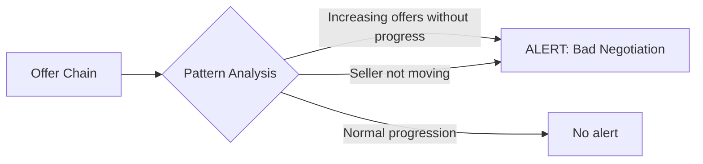

---

## Flujo de Datos en Base de Datos

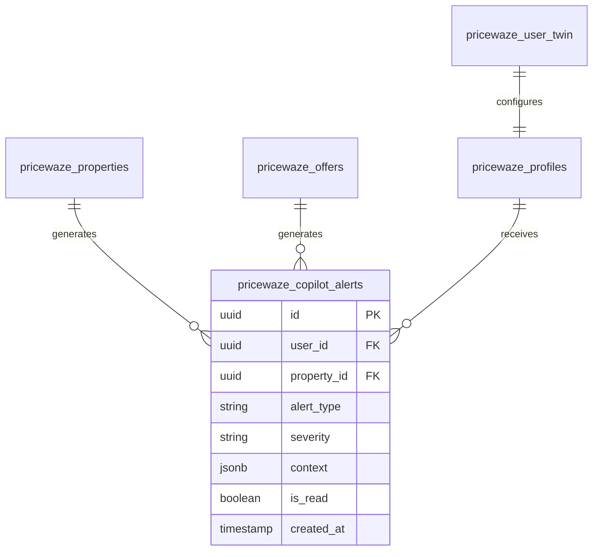

---

## API Endpoints

### GET /api/copilot/alerts
```typescript
// Response
{
  alerts: CopilotAlert[];
  unread_count: number;
  last_checked: string;
}
```

### POST /api/copilot/property-viewed
```typescript
// Request
{ property_id: string }

// Response - Triggers alert evaluation
{ alerts: CopilotAlert[] }
```

### PATCH /api/copilot/alerts/[id]
```typescript
// Request
{ is_read: true }

// Response
{ success: boolean }
```

---

## Frontend Integration

### useCopilotAlerts Hook

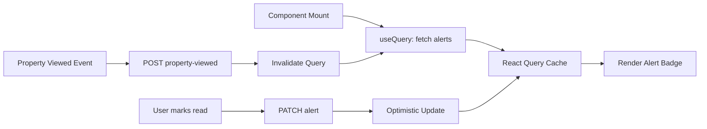

### Alert UI States

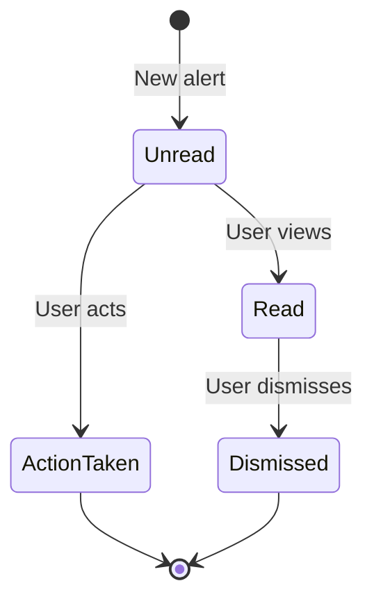

---

## Tablas Involucradas

| Tabla | Rol |
|-------|-----|
| `pricewaze_copilot_alerts` | Almacena alertas generadas |
| `pricewaze_user_twin` | Configuracion de preferencias |
| `pricewaze_properties` | Datos para analisis |
| `pricewaze_offers` | Ofertas para analisis |
| `pricewaze_property_signals` | Senales de mercado |

---

## Alert Types y Severities

| Type | Severity | Description |
|------|----------|-------------|
| `emotional_pricing` | high | Precio inflado por emociones |
| `timing_issue` | medium | Mal momento para actuar |
| `zone_inflection` | medium | Cambio de tendencia en zona |
| `suboptimal_offer` | medium | Oferta fuera de rango optimo |
| `hidden_risk` | high | Riesgo oculto detectado |
| `silent_opportunity` | low | Oportunidad no evidente |
| `bad_negotiation` | high | Patron de negociacion pobre |

---

## Archivos Relevantes

- `src/app/api/copilot/alerts/route.ts` - API endpoints
- `src/app/api/copilot/property-viewed/route.ts` - Trigger evaluation
- `src/hooks/useCopilotAlerts.ts` - React hook
- `src/components/copilot/` - UI components
- `src/lib/die/copilot-explanations.ts` - Explanation generation
- `supabase/migrations/` - Detection functions SQL

---

## Performance Considerations

1. **Caching**: React Query con staleTime de 30s
2. **Batch Processing**: Multiples detections en una transaccion
3. **Indexing**: Indices en user_id, property_id, is_read
4. **Polling**: Fallback cada 60s si no hay WebSocket

---

*Ultima actualizacion: 2026-01-08*
