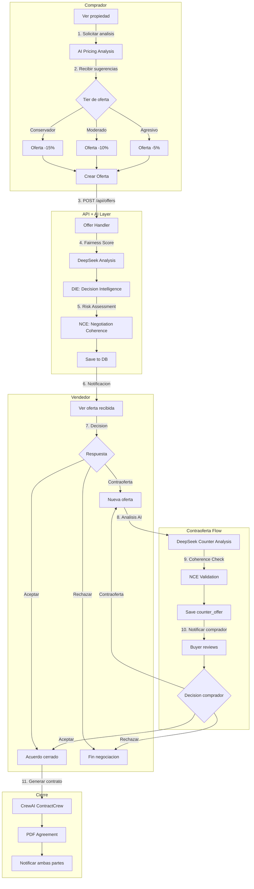
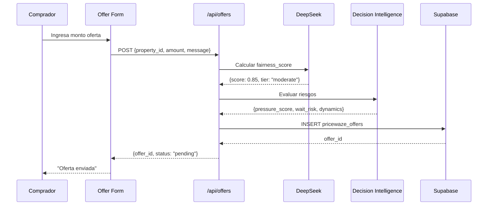
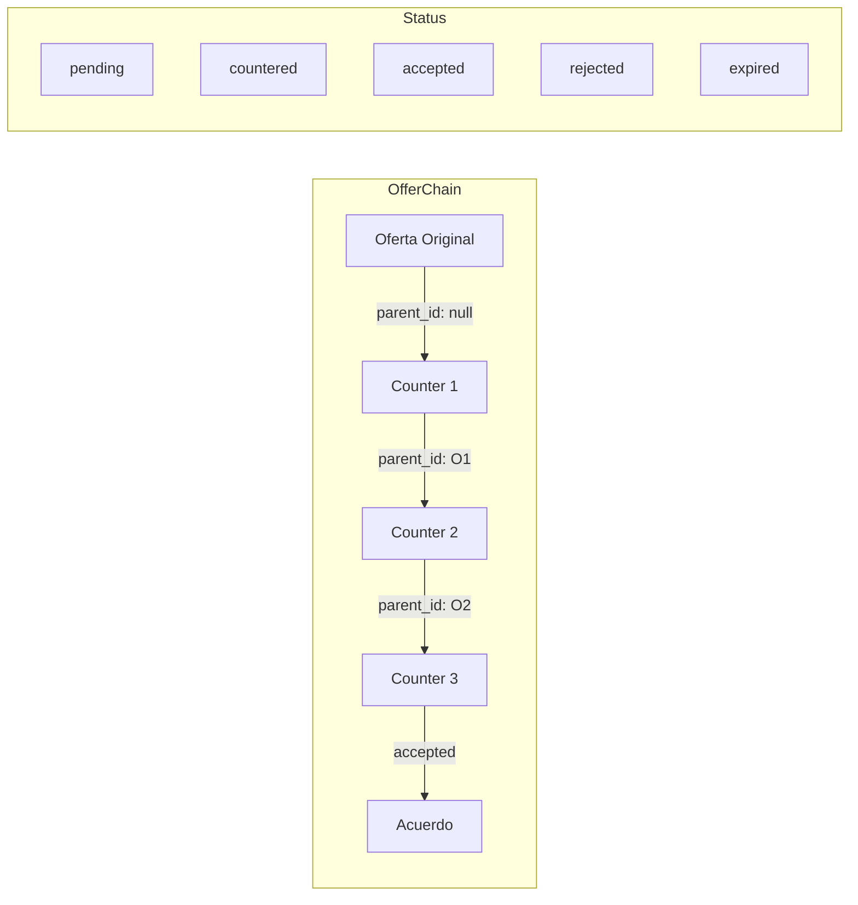
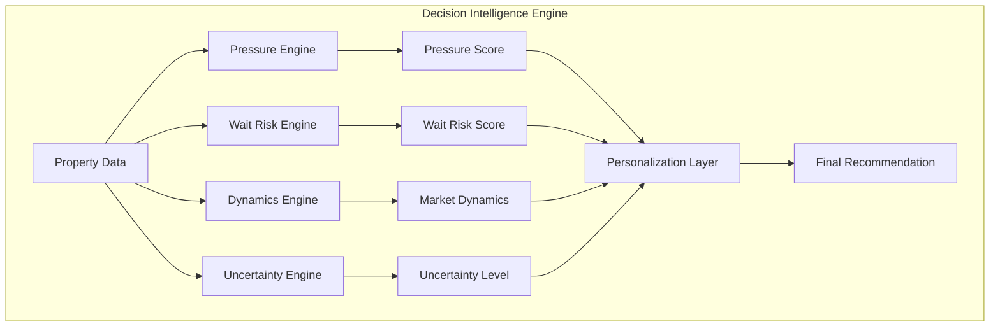
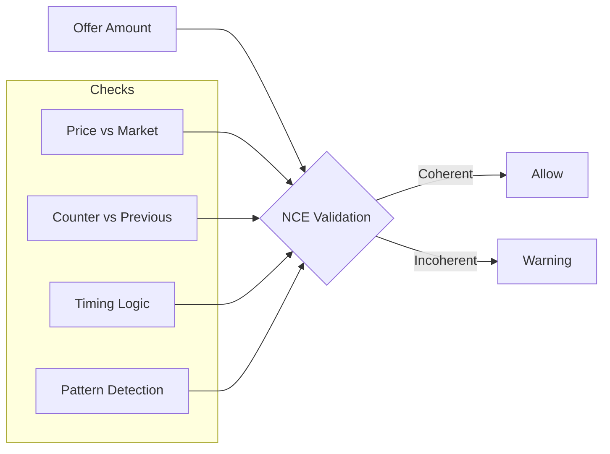
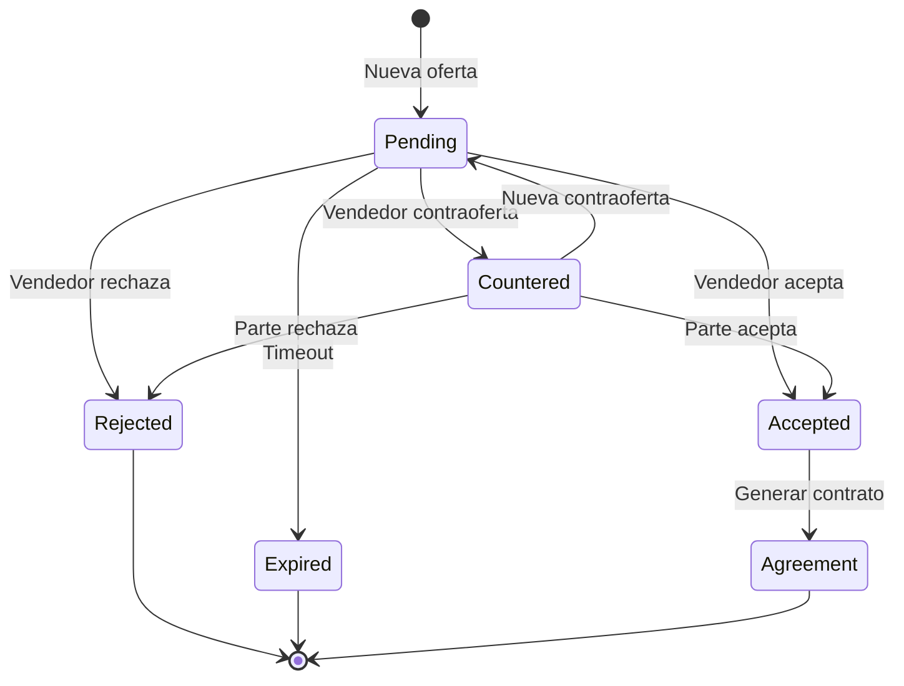

# Data Flow Diagram: Negotiation Flow

## Overview
Este diagrama muestra el flujo completo de negociacion en PriceWaze, desde la oferta inicial hasta el cierre del acuerdo.

---

## Diagrama de Flujo Principal



---

## Flujo de Oferta Detallado

### 1. Creacion de Oferta



### 2. Cadena de Ofertas (Counter-Offers)



---

## AI Analysis Pipeline

### Decision Intelligence Engine (DIE)



### Negotiation Coherence Engine (NCE)



---

## Tablas Involucradas

| Tabla | Rol | Operaciones |
|-------|-----|-------------|
| `pricewaze_offers` | Ofertas y contraofertas | INSERT, UPDATE |
| `pricewaze_properties` | Datos de propiedad | SELECT |
| `pricewaze_property_insights` | Insights AI | INSERT, UPDATE |
| `pricewaze_agreements` | Contratos finales | INSERT |
| `pricewaze_copilot_alerts` | Alertas durante negociacion | INSERT |

---

## Estructura de Oferta

```typescript
interface Offer {
  id: string;
  property_id: string;
  buyer_id: string;
  seller_id: string;
  amount: number;
  message?: string;
  status: 'pending' | 'accepted' | 'rejected' | 'countered' | 'expired';
  parent_offer_id?: string; // Para contraofertas
  fairness_score: number;
  die_analysis: DIEAnalysis;
  nce_validation: NCEResult;
  expires_at: Date;
  created_at: Date;
  updated_at: Date;
}
```

---

## Estados de Negociacion



---

## Copilot Alerts durante Negociacion

El Copilot puede generar alertas automaticas durante el flujo:

| Alerta | Trigger | Severidad |
|--------|---------|-----------|
| `emotional_pricing` | Precio muy alto vs mercado | High |
| `suboptimal_offer` | Oferta en tier incorrecto | Medium |
| `bad_negotiation` | Patron de negociacion pobre | High |
| `hidden_risk` | Riesgo oculto detectado | Critical |
| `silent_opportunity` | Oportunidad no aprovechada | Low |

---

## Archivos Relevantes

- `src/app/api/offers/route.ts` - CRUD ofertas
- `src/lib/die/` - Decision Intelligence Engine
- `src/lib/negotiation-coherence/` - NCE
- `src/lib/ai/pricing.ts` - Fairness scoring
- `crewai/crews/negotiation_crew.py` - CrewAI negotiation
- `src/components/offers/` - UI components

---

*Ultima actualizacion: 2026-01-08*
