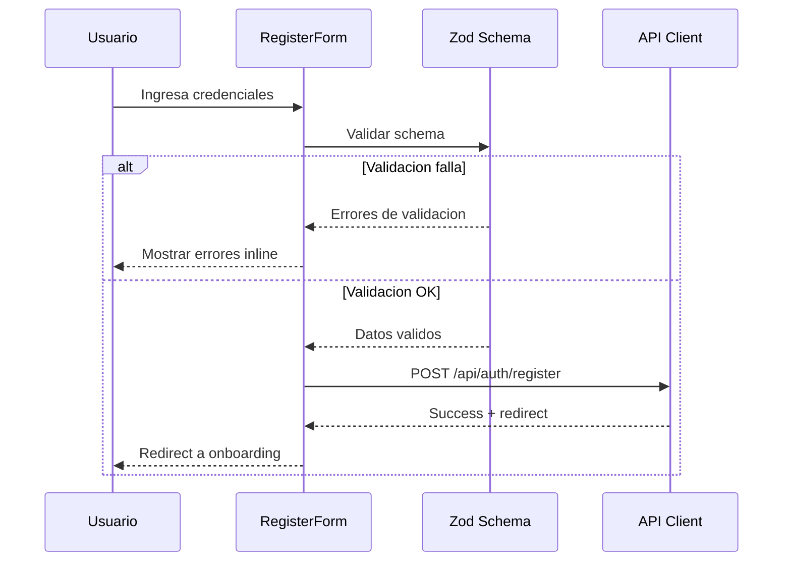
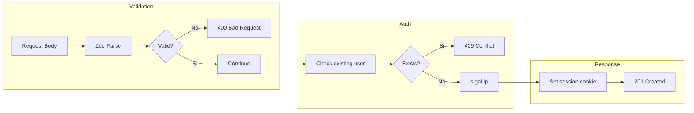
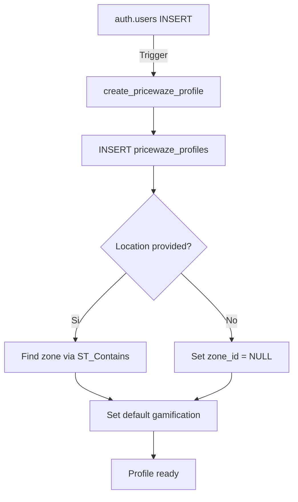

# Data Flow Diagram: User Registration

## Overview
Este diagrama muestra el flujo de datos durante el registro de un nuevo usuario en PriceWaze.

---

## Diagrama de Flujo Principal

```mermaid
flowchart TD
    subgraph Cliente["Cliente (Browser)"]
        A[Usuario] -->|1. Ingresa email + password| B[Register Form]
        B -->|2. Validacion Zod| C{Datos validos?}
        C -->|No| D[Mostrar errores]
        D --> B
        C -->|Si| E[Submit to API]
    end

    subgraph API["Next.js API Routes"]
        E -->|3. POST /api/auth/register| F[Auth Route Handler]
        F -->|4. Validar servidor| G{Email unico?}
        G -->|No| H[Return 409 Conflict]
        G -->|Si| I[Crear usuario Supabase]
    end

    subgraph Supabase["Supabase Backend"]
        I -->|5. supabase.auth.signUp| J[auth.users]
        J -->|6. Trigger automatico| K[pricewaze_profiles]
        K -->|7. Asignar zona default| L[PostGIS ST_Contains]
        L --> M[Return user + session]
    end

    subgraph PostAuth["Post-Registration"]
        M -->|8. Set cookies| N[Session establecida]
        N -->|9. Redirect| O[/onboarding]
        O -->|10. Completar perfil| P[Profile completo]
    end

    H -->|Error response| B
```

---

## Flujo Detallado por Componente

### 1. Frontend (React)



### 2. API Layer



### 3. Database Triggers



---

## Tablas Involucradas

| Tabla | Rol | Operacion |
|-------|-----|-----------|
| `auth.users` | Supabase Auth | INSERT (nuevo usuario) |
| `pricewaze_profiles` | Perfil extendido | INSERT via trigger |
| `pricewaze_zones` | Zonas geograficas | SELECT (asignar zona) |
| `pricewaze_gamification_profiles` | Gamificacion | INSERT (perfil inicial) |

---

## Validaciones

### Frontend (Zod)
```typescript
const registerSchema = z.object({
  email: z.string().email("Email invalido"),
  password: z.string().min(8, "Minimo 8 caracteres"),
  name: z.string().min(2, "Nombre requerido"),
});
```

### Backend
- Email unico en auth.users
- Password strength (Supabase default)
- Rate limiting (Supabase built-in)

---

## Estados de Error

| Codigo | Descripcion | Accion Usuario |
|--------|-------------|----------------|
| 400 | Datos invalidos | Corregir formulario |
| 409 | Email ya existe | Usar otro email o login |
| 500 | Error interno | Reintentar o contactar soporte |

---

## Archivos Relevantes

- `src/app/(auth)/register/page.tsx` - Pagina de registro
- `src/app/api/auth/register/route.ts` - API endpoint
- `src/lib/supabase/server.ts` - Cliente Supabase server
- `supabase/migrations/` - Triggers de perfil

---

*Ultima actualizacion: 2026-01-08*
