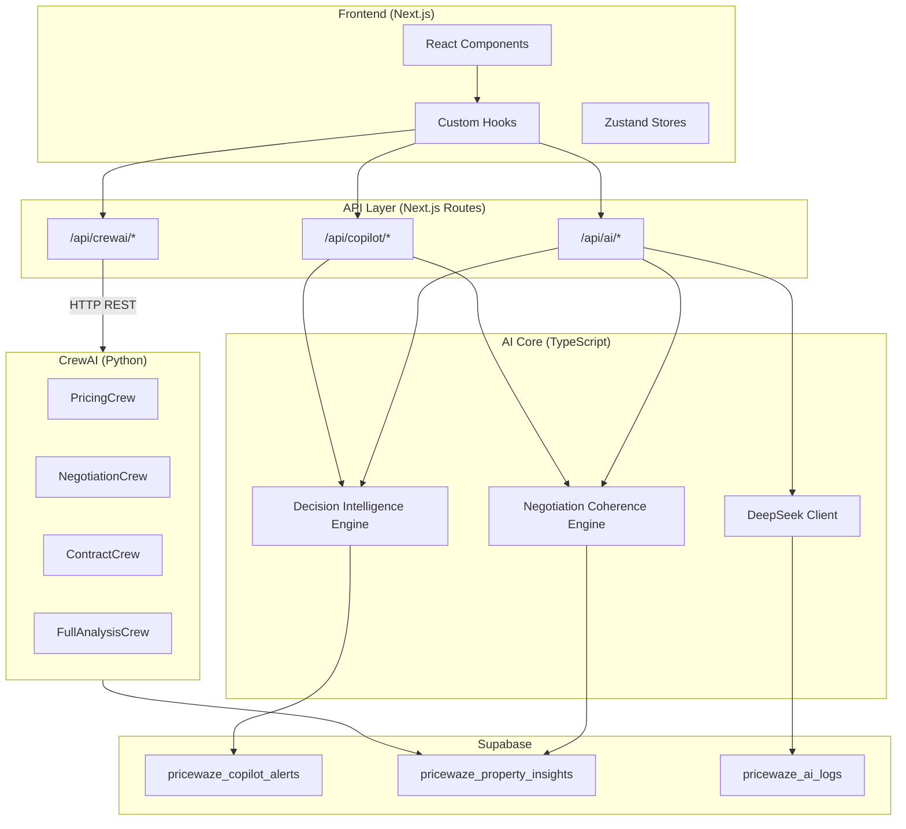
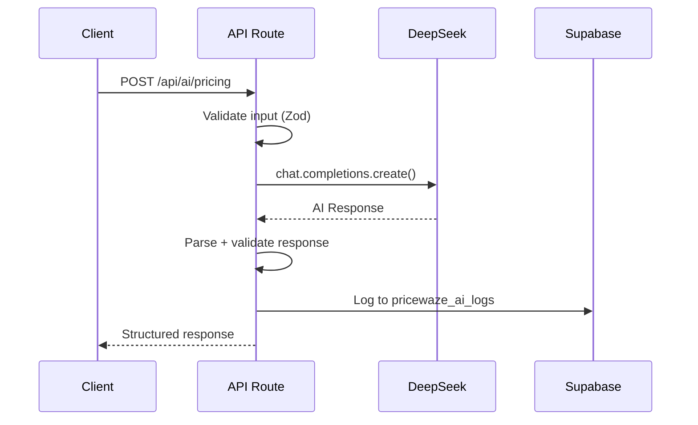
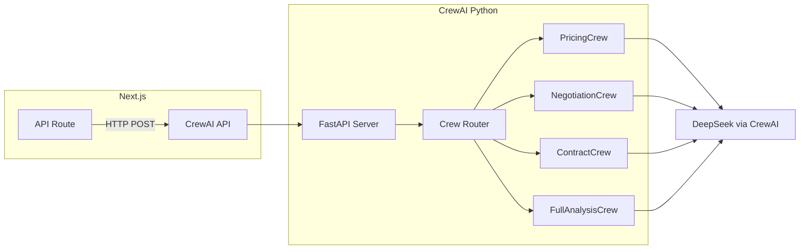
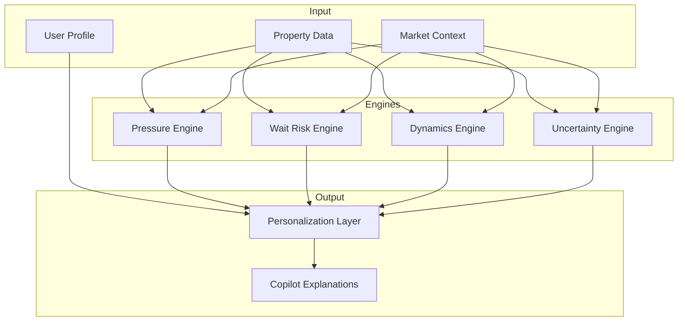
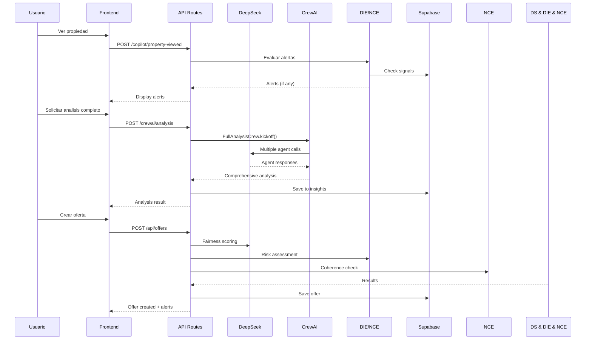

# AI Systems Integration

## Overview

PriceWaze utiliza tres sistemas de AI que trabajan en conjunto:

1. **DeepSeek API** - LLM principal para analisis rapidos
2. **CrewAI** - Sistema multi-agente para analisis complejos
3. **Copilot** - Sistema de alertas inteligentes con DIE/NCE

---

## Arquitectura de Integracion



---

## 1. DeepSeek Integration

### Configuracion

```typescript
// src/lib/ai/client.ts
import OpenAI from 'openai';

export const ai = new OpenAI({
  apiKey: process.env.DEEPSEEK_API_KEY,
  baseURL: process.env.DEEPSEEK_BASE_URL, // https://api.deepseek.com
});

export const DEEPSEEK_MODEL = process.env.DEEPSEEK_MODEL || 'deepseek-chat';
```

### Endpoints

| Endpoint | Funcion | Latencia |
|----------|---------|----------|
| `/api/ai/pricing` | Fairness scoring + offer tiers | 2-5s |
| `/api/ai/advice` | Negotiation advice | 3-6s |
| `/api/ai/contracts` | Contract generation | 5-10s |
| `/api/ai/decision-intelligence` | DIE-based insights | 2-4s |

### Flujo de Llamada



### Error Handling con Fallback

```typescript
async function callAI(prompt: string) {
  try {
    return await ai.chat.completions.create({
      model: DEEPSEEK_MODEL,
      messages: [{ role: 'user', content: prompt }],
      temperature: 0.7,
    });
  } catch (error) {
    // Log error
    console.error('DeepSeek error:', error);

    // Fallback to OpenAI if configured
    if (process.env.OPENAI_API_KEY) {
      const fallback = new OpenAI({ apiKey: process.env.OPENAI_API_KEY });
      return await fallback.chat.completions.create({
        model: 'gpt-4o-mini',
        messages: [{ role: 'user', content: prompt }],
      });
    }

    throw error;
  }
}
```

---

## 2. CrewAI Integration

### Arquitectura



### Endpoints CrewAI

| Endpoint | Crew | Agentes | Timeout |
|----------|------|---------|---------|
| `/api/crewai/pricing` | PricingCrew | Market + Pricing | 30s |
| `/api/crewai/negotiation` | NegotiationCrew | Market + Pricing + Negotiation | 45s |
| `/api/crewai/contracts` | ContractCrew | Legal + Pricing | 60s |
| `/api/crewai/analysis` | FullAnalysisCrew | All 4 agents | 90s |

### API Bridge

```typescript
// src/app/api/crewai/pricing/route.ts
export async function POST(request: Request) {
  const { propertyId, zoneId, context } = await request.json();

  try {
    const response = await fetch(`${process.env.CREWAI_URL}/pricing`, {
      method: 'POST',
      headers: { 'Content-Type': 'application/json' },
      body: JSON.stringify({
        property_id: propertyId,
        zone_id: zoneId,
        context,
      }),
      signal: AbortSignal.timeout(30000),
    });

    if (!response.ok) {
      throw new Error(`CrewAI error: ${response.status}`);
    }

    const result = await response.json();
    return NextResponse.json(result);
  } catch (error) {
    // Fallback to direct DeepSeek
    return await fallbackToPricing(propertyId);
  }
}
```

### Agentes Definidos

```python
# crewai/agents/market_analyst.py
market_analyst = Agent(
    role="Market Analyst",
    goal="Analyze zone statistics and market trends",
    backstory="Expert real estate market analyst...",
    tools=[ZoneStatsTool(), MarketTrendsTool()],
    llm=deepseek_llm,
)

# crewai/agents/pricing_analyst.py
pricing_analyst = Agent(
    role="Pricing Analyst",
    goal="Calculate property valuation and offer tiers",
    backstory="Senior property valuation specialist...",
    tools=[ComparablesTool(), ValuationTool()],
    llm=deepseek_llm,
)

# crewai/agents/negotiation_advisor.py
negotiation_advisor = Agent(
    role="Negotiation Advisor",
    goal="Develop counter-offer strategy",
    backstory="Expert negotiation strategist...",
    tools=[OfferHistoryTool(), PsychologyTool()],
    llm=deepseek_llm,
)

# crewai/agents/legal_advisor.py
legal_advisor = Agent(
    role="Legal Advisor",
    goal="Review contracts and ensure compliance",
    backstory="Real estate attorney specialist...",
    tools=[ContractTemplateTool(), ComplianceTool()],
    llm=deepseek_llm,
)
```

---

## 3. Copilot Integration (DIE + NCE)

### Decision Intelligence Engine (DIE)



### Archivos DIE

```
src/lib/die/
├── pressure-engine.ts      # Detecta puntos de presion
├── wait-risk-engine.ts     # Evalua riesgos de esperar
├── dynamics-engine.ts      # Modela dinamicas de mercado
├── uncertainty-engine.ts   # Cuantifica incertidumbre
├── personalization-layer.ts # Adapta a perfil usuario
└── copilot-explanations.ts # Genera explicaciones
```

### Negotiation Coherence Engine (NCE)

```typescript
// src/lib/negotiation-coherence/index.ts
export interface NCEResult {
  isCoherent: boolean;
  warnings: NCEWarning[];
  suggestions: string[];
  confidenceScore: number;
}

export async function validateNegotiation(
  offer: Offer,
  history: Offer[],
  marketData: MarketData
): Promise<NCEResult> {
  // Check price coherence
  const priceCheck = checkPriceCoherence(offer, marketData);

  // Check counter-offer logic
  const counterCheck = checkCounterLogic(offer, history);

  // Check timing patterns
  const timingCheck = checkTimingPatterns(offer, history);

  return aggregateChecks([priceCheck, counterCheck, timingCheck]);
}
```

### API Copilot

| Endpoint | Funcion |
|----------|---------|
| `/api/copilot/alerts` | CRUD alertas |
| `/api/copilot/property-viewed` | Evaluar alertas al ver propiedad |
| `/api/copilot/chat` | Chat conversacional |
| `/api/copilot/negotiate` | Asistencia en negociacion |

---

## Flujo de Interaccion Completo



---

## Data Contracts

### DeepSeek Request

```typescript
interface DeepSeekRequest {
  model: string;
  messages: {
    role: 'system' | 'user' | 'assistant';
    content: string;
  }[];
  temperature?: number;
  max_tokens?: number;
}
```

### CrewAI Request

```typescript
interface CrewAIRequest {
  property_id: string;
  zone_id?: string;
  context?: {
    user_preferences?: Record<string, unknown>;
    market_snapshot?: MarketData;
  };
}
```

### Copilot Alert

```typescript
interface CopilotAlert {
  id: string;
  user_id: string;
  property_id: string;
  alert_type: AlertType;
  severity: 'low' | 'medium' | 'high' | 'critical';
  title: string;
  message: string;
  context: Record<string, unknown>;
  action_url?: string;
  is_read: boolean;
  created_at: string;
}
```

---

## Configuracion de Entorno

```env
# DeepSeek
DEEPSEEK_API_KEY=sk-...
DEEPSEEK_BASE_URL=https://api.deepseek.com
DEEPSEEK_MODEL=deepseek-chat

# CrewAI (si desplegado separado)
CREWAI_URL=http://localhost:8000
CREWAI_API_KEY=...

# Fallback
OPENAI_API_KEY=sk-... # Opcional, para fallback
```

---

## Monitoring y Logging

### AI Logs Table

```sql
CREATE TABLE pricewaze_ai_logs (
  id UUID PRIMARY KEY DEFAULT gen_random_uuid(),
  provider TEXT NOT NULL, -- 'deepseek', 'crewai', 'openai'
  endpoint TEXT NOT NULL,
  request_payload JSONB,
  response_payload JSONB,
  latency_ms INTEGER,
  status TEXT, -- 'success', 'error', 'timeout'
  error_message TEXT,
  user_id UUID REFERENCES auth.users(id),
  created_at TIMESTAMPTZ DEFAULT NOW()
);
```

### Metricas Clave

- Latencia promedio por endpoint
- Tasa de error por provider
- Uso de fallback
- Tokens consumidos

---

## Troubleshooting

| Problema | Causa Probable | Solucion |
|----------|----------------|----------|
| Timeout CrewAI | Crew muy complejo | Reducir agentes o aumentar timeout |
| DeepSeek 429 | Rate limit | Implementar retry con backoff |
| Respuesta invalida | Parsing error | Validar con Zod schema |
| Fallback activado | DeepSeek down | Verificar status page |

---

*Ultima actualizacion: 2026-01-08*
